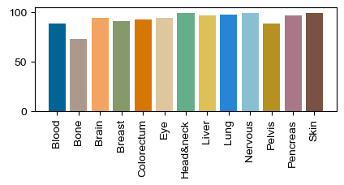

# 	Domain generalization enables general cancer cell annotation in single-cell and spatial transcriptomics  
Article : https://www.nature.com/articles/s41467-024-46413-6
## Abstract
Single-cell and spatial transcriptome sequencing, two recently optimized transcriptome sequencing methods, are increasingly used to study cancer and related diseases. Cell annotation, particularly for malignant cell annotation, is essential and crucial for in-depth analyses in these studies. However, current algorithms lack accuracy and generalization, making it difficult to consistently and rapidly infer malignant cells from pan-cancer data. To address this issue, we present Cancer-Finder, a domain generalization-based deep learning algorithm that can rapidly identify malignant cells/spots in single-cell and spatial transcriptomics data. Additionally, Cancer-Finder integrated an interpretability module, which can utilizes a saliency map to identified important genes related to prognosis and tumor microenvironment.

## Set Up Environment

Prerequisites:
```
System: Ubuntu 18.04
python: 3.9.16
CUDA: 11.6
torch: 1.13.1
```
You can build the environment with Anaconda:
```
conda create -n scf python==3.9.16
conda activate scf
pip install -r requirements.txt
```

## Running the Code
### Usage and Options - Inference


A input count matrix should be :


| SYMBOL | Cell 1 | Cell 2 |  ... |Cell n|
| :----:| :----: | :----: |  :----: | :----: | 
|Gene 1|0|2|...|0|  
|Gene 2|0|0|...|1|
|...|...|...|...|...|
|Gene n|0|0|...|0|


`tsv`, `csv` and  `h5ad` format are supported.


It can be used for new inference by executing the following command:  

```
python -u infer.py --ckp=checkpoints/sc_pretrain_article.pkl --matrix=data_matrix.tsv --out=out.csv
```

The parameter `ckp` denotes the checkpoints of pre-trained model used for inference.
The checkpoints used in article for [scRNA-seq data](https://drive.google.com/file/d/1l05-wMbPucfC4IG4oDmT5U-TOn_YZazL/view?usp=drive_link) and [spatial transcriptomics (ST) data](https://drive.google.com/file/d/1ci78ccgSwZStWU14PRR-OklDWRhI-8rf/view?usp=drive_link) are available for download. 

If you wish to perform inference on your own dataset, please replace `data_matrix.tsv` with your own expression matrix.  
`tsv` and `csv` format are supported.

---


Regarding the data (train, val and test), please refer to the "Data availability" and "Methods" section of the [article](https://www.nature.com/articles/s41467-024-46413-6).  
The “Data Availability” section of the article provides a detailed description of the test data, including Cell line data, Peripheral Blood Mononuclear Cells (PBMC) data, and other data from patients. The corresponding test results are presented in Figure 3b.  
The sample test data in previous versions is also from the “Data Availability” section.    

---


More usage for **inference**:
```
python -u infer.py \     
    --ckp=<ckp_file> \   # path for pre-trained model
    --matrix=<data_file> \ # path for data, "tsv", "csv" and  "h5ad" format are supported. 
    --out=<output_file> \ # out path
    --threshold=<threshold> # threshold of inference, default=0.5. Recommended to use 0.5 for scRNA-seq, 10x Visium, legacy ST and slide-seq data. Recommended to use 0.9766 for MERFISH data.
```

Additionally, a pre-trained model trained with 476,562 cells (148,332 more cells than the article.) from 13 tissues can also be [downloaded](https://drive.google.com/file/d/1qwWMl0WtOwBzUhUdxL72331gNqnp3F2i/view?usp=drive_link). Its internal performance is as follows. 

 


---
### Usage and Options - Train

 
If you want train **a gene set**, please run the command:
```
python -u train_gene_set.py
```


If you want to **train**  **without a gene set**, just to train a pre-trained model for inference. Please run the command:  
```
python -u train.py
```  

By default, the preceding command will use the data within `data/train/*` as from the training domain and `data/val/*` as from the validation domain for training.

More usage for **training**:
```
python -u train.py  \
    --train_dir=<train_dir> \     # Directory of training data
    --val_dir=<val_dir> \         # Directory of val data
    --batch_size=<batch_size> \   # batch size
    --lr=<learning_rate> \        # learning rate
    --max_epoch=<max_epoch> \     # max epoch
    --output=<output_dir> \       # The output directory of training, including checkpoint and the gene list, and logs files
    --gpu_id=<id>                 # Not necessary, Specify the No. of the gpu if it is available
```


## License

This project is licensed under the MIT License - see the [LICENSE](LICENSE) file for details.