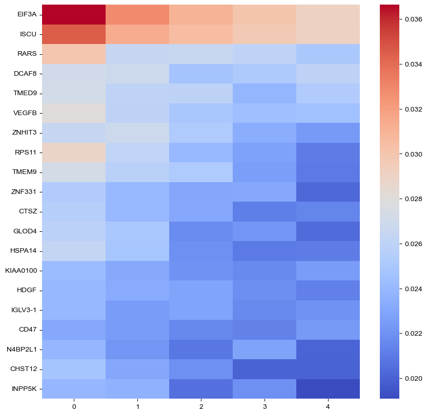

# 	Cancer-Finder: Domain generalization enables general cancer cell annotation in single-cell and spatial transcriptomics  

## Abstract
Single-cell and spatial transcriptome sequencing, two recently optimized transcriptome sequencing methods, are increasingly used to study cancer and related diseases. Cell annotation, particularly for malignant cell annotation, is essential and crucial for in-depth analyses in these studies. However, current algorithms lack accuracy and generalization, making it difficult to consistently and rapidly infer malignant cells from pan-cancer data. To address this issue, we present Cancer-Finder, a domain generalization-based deep learning algorithm that can rapidly identify malignant cells/spots in single-cell and spatial transcriptomics data. Additionally, Cancer-Finder integrated an interpretability module, which can utilizes a modified saliency map to identified important genes related to prognosis and tumor microenvironment.

## Set Up Environment

Prerequisites:
```
System: Ubuntu 18.04
python: 3.9.16
CUDA: 11.6
torch: 1.13.1
```
You can build the environment with Anaconda:
```
conda create -n scf python==3.9.16
conda activate scf
pip install -r requirements.txt
```

## Running the Code
### Usage and Options - Inference


A input matrix should be :


| SYMBOL | Cell 1 | Cell 2 |  ... |Cell n|
| :----:| :----: | :----: |  :----: | :----: | 
|Gene 1|1|0|...|0|  
|Gene 2|0|0|...|1|
|...|...|...|...|...|
|Gene n|0|0|...|0|


Format `tsv`, `csv` and  `h5ad` are supported.


The pretrained models used in article can be downloaded for [sc-RNA data](https://drive.google.com/file/d/1l05-wMbPucfC4IG4oDmT5U-TOn_YZazL/view?usp=drive_link) and [ST data](https://drive.google.com/file/d/1ci78ccgSwZStWU14PRR-OklDWRhI-8rf/view?usp=drive_link).


It can be used for new inference by executing the following command:  

```
python -u infer.py --ckp=checkpoints/sc_pretrain_article.pkl --matrix=sample_data/sample_data_matrix.tsv --out=out.csv
```

The `out.csv` file contains examples of the expected output.  

The purpose of the above command is to infer the malignancy status of cells in the expression matrix `sample_data/sample_data_matrix.tsv`.   
  
  
This is a sample dataset consisting of 10 cancer cell lines and 10 healthy human peripheral blood cells, and its output should typically appear as follows:  


| sample | predict |
| :----:| :----: |
|AAACCCAGTATATGGA-1|0|
|AAACCCAGTATCGTAC-1|0|
|...|...|
|Lib90_00009|1|  

 


If you wish to perform inference on your own dataset, simply replace `sample_data/sample_data_matrix.txt` with your own expression matrix.


More usage for **inference**:
```
python -u infer.py \     
    --ckp=<ckp_file> \   # path for pretrained model
    --matrix=<data_file> \ # path for data, format "tsv", "csv" and  "h5ad" are supported. 
    --out=<output_file> \ # out path
    --threshold=<threshold> # threshold of inference, default=0.5. Recommended 0.5 for use on scRNA, 10x Visium, legacy ST and slide-seq data. Recommended 0.9766 for MERFISH data
```

Additionally, a pre-trained model trained with 476,562 cells can also be [downloaded](https://drive.google.com/file/d/1v09bMQ5eO7YWXi6TKxPn4OZGj2rau_OE/view?usp=drive_link), and more pretrained models are being updated.  
  
---
---
### Usage and Options - Interpretability and Training  

 
If you want to use the **interpretability** module, to train **with** interpretability please run the command:
```
python -u train_saliency_map.py
```
By default, the preceding command will use the data within `data/train/*` as from the training domain and `data/val/*` as from the validation domain for training.

There is an output sample in the folder `sample_result_saliency` : 

  

More usage for **interpretability**:
```
python -u train_saliency_map.py  \
    --train_dir=<train_dir> \     # Directory of training data
    --val_dir=<val_dir> \         # Directory of val data
    --batch_size=<batch_size> \   # batch size
    --lr=<learning_rate> \        # learning rate
    --max_epoch=<max_epoch> \     # max epoch
    --output=<output_dir> \       # The output directory, including the salience of genes, and the top 20 genes.
    --gpu_id=<id>                 # Not necessary, Specify the No. of the gpu if it is available
```


If you want to **train**  **without** interpretability, to train a pretrained model for inference, please run the command:  
```
python -u train.py
```

More usage for **training**:
```
python -u train.py  \
    --train_dir=<train_dir> \     # Directory of training data
    --val_dir=<val_dir> \         # Directory of val data
    --batch_size=<batch_size> \   # batch size
    --lr=<learning_rate> \        # learning rate
    --max_epoch=<max_epoch> \     # max epoch
    --output=<output_dir> \       # The output directory of training, including checkpoint and the gene list, and logs files
    --gpu_id=<id>                 # Not necessary, Specify the No. of the gpu if it is available
```


## License

This project is licensed under the MIT License - see the [LICENSE](LICENSE) file for details.